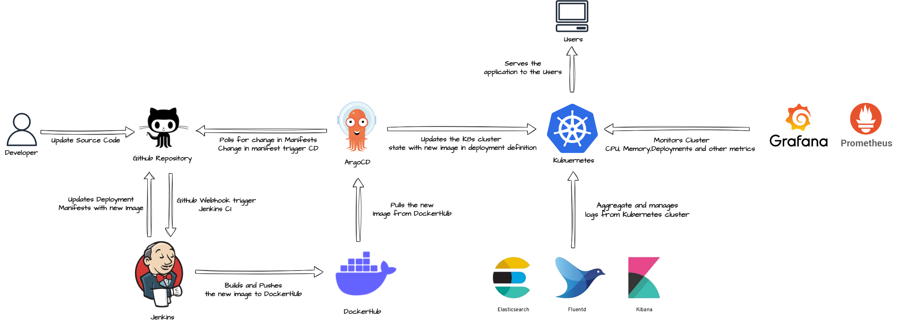

# Simulating a Production-Grade Infrastructure Locally

Have you ever been curious about how Google handles an infrastructure that can handle a staggering 8.5 billion searches daily ?

This project aims to help you understand the foundation of such environment by guiding you through the process of creating, designing, and managing a production-ready infrastructure right on your own computer. It transforms a simple application into a robust deployment within a Kubernetes environment, automates application updates using Jenkins and Argo CD, offers user-friendly monitoring dashboards with Prometheus and Grafana, and provides log management and analysis with the EFK stack.

[QuickStart](#the-implementation)

**Note:** It's important to keep in mind that this project offers a high-level overview of a production-level infrastructure, providing foundational knowledge only. In reality, production infrastructures are often much more complex and larger.

## **Purpose**

The primary aim of this project is to provide an practical learning experience, helping you gain valuable insights into the requirements and complexities of designing, creating and managing production-grade infrastructure. By actively engaging with this project, you'll develop a deep understanding of the essential prerequisites for deploying and maintaining enterprise-level infrastructure.

## **Project Deliverables**

This project lets you simulate a high-level production-grade infrastructure on your local. This includes:

1. **Docker Image for our Django CRUD Application**
2. **Argo CD for Continuous Deployment**
3. **Continuous Integration with Jenkins**
4. **Monitoring with Prometheus and Grafana**
5. **Managing and analyzing Logs using EFK Stack**

## Project Alignment with Enterprise-Level Requirements

| Enterprise-Level Requirement | Status | How We Achieve It                                                                                                 |
| ---------------------------- | ------ | ----------------------------------------------------------------------------------------------------------------- |
| Scalability                  | ✔      | By providing insights into designing and managing infrastructure.                                                 |
| Automation                   | ✔      | Automation of deployment and updates using Argo CD and Jenkins.                                                   |
| Monitoring                   | ✔      | Robust monitoring capabilities through Prometheus and Grafana.                                                    |
| Logging                      | ✔      | Log management and analysis with the EFK stack.                                                                   |
| High Availability            | ❌      | Not a primary focus in this local simulation, but could be easily achieved by scaling vertically and horizontally |
| Security                     | ❌      | Security measures are limited in this project due to local simulation.                                            |
| Load Balancing               | ❌      | Load balancing is not a primary focus in this local setup.                                                        |
| Disaster Recovery            | ❌      | Disaster recovery aspects are not covered in this project.                                                        |
| Compliance                   | ❌      | Compliance requirements are not addressed in this simulation.                                                     |
| Cost Optimization            | ❌      | Cost optimization strategies are not explored in this local setup.                                                |

**Please note** that while our project addresses several enterprise-level requirements, it primarily serves as a learning and simulation tool and doesn't not cover all aspects of a production-grade enterprise environment.

## The Implementation

### Architecture Diagram

### The Flow of Docs
In each stage, there are two types of documentation. The primary documentation is called `README`, located at the root of each stage. It provides information about the tools or technologies used in that stage, explaining their significance and purpose. Additionally, there are guides available to help you implement each stage.

To make navigation easier, each step includes both `Previous` and `Next` buttons. This means you can seamlessly move between steps or stages without having to return to this section repeatedly.

**Note:** Please be aware that, due to limited computing resources, we will be working with scaled-down versions of all components. In some cases, we may need to temporarily disregard certain security measures. However, for details on what changes in a real production environment, refer to sections marked with the heading `Production`.

### The Flow of the Project

This  project is divided into 5 stages. We'll delve into one stage at a time.

| Stage        | Deliverables                                      | Tools                          | Steps                                                                                                                                                                                                                                                                                                                                                                                                                   |
| ------------ | ------------------------------------------------- | ------------------------------ | ----------------------------------------------------------------------------------------------------------------------------------------------------------------------------------------------------------------------------------------------------------------------------------------------------------------------------------------------------------------------------------------------------------------------- |
| Prerequisite | Install Docker                                    | Linux, Docker                  | [01. Prerequisite](./docs/00.%20Prerequisite/README.md)   [02. Understand Our Django Application](./docs/00.%20Prerequisite/Understand-Our-Django-Application.md)                                                                                                                                                                                                                                                    |
| Stage 1      | Build Docker Images                               | Docker                         | [01.Understand Docker Stage](./docs/01.%20Docker/README.md)   [02. Build Docker Image For Django App](./docs/01.%20Docker/01-Docker-Image-Django-App.md)   [03. Build Docker Image For Jenkins agent](./docs/01.%20Docker/02-Docker-Image-For-Jenkins-Agent.md)                                                                                                                                                   |
| Stage 2      | Setup continuous deployment using ArgoCD          | Argo CD, Kubernetes            | [01. Understand Kubernetes and Continuous Deployment stage](./docs/02.%20Kubernetes%20&%20ArgoCD/README.md)   [02. Configure k8s Cluster](./docs/02.%20Kubernetes%20&%20ArgoCD/01.%20Configure-k8s-cluster.md)   [03. Configure ArgoCD](./docs/02.%20Kubernetes%20&%20ArgoCD/02.%20Configure-argocd.md)   [04. Deploy app using ArgoCD](./docs/02.%20Kubernetes%20&%20ArgoCD/03.%20Deploy-app-using-argocd.md) |
| Stage 3      | Setup continuous integration using Jenkins        | Jenkins Server                 | [01. Understand Continuous Integration Stage](./docs/03.%20Jenkins/README.md)   [02. Setup Continuous Integration Pipeline](./docs/03.%20Jenkins/jenkins-setup-for-ci.md)                                                                                                                                                                                                                                            |
| Stage 4      | Setup monitoring using Prometheus and Grafana     | Prometheus, Grafana            | [01. Understand Monitoring Stage](./docs/04.%20Monitoring%20&%20Alerting/README.md)   [02. Configure Prometheus and Grafana on K8s cluster](./docs/04.%20Monitoring%20&%20Alerting/01.%20Install-Prometheus-Grafana.md)   [03. Setup Grafana Dashboard](./docs/04.%20Monitoring%20&%20Alerting/02-Setup-Grafana-Dashboards.md)   [04. Setup Alerts](./docs/04.%20Monitoring%20&%20Alerting/03-Setup-Alerts.md) |
| Stage 5      | Setup log management and analysis using EFK Stack | Elasticsearch, Fluentd, Kibana | [01. Understand Log management and analysis stage](./docs/05.%20EFK/README.md)   [02. Configure EFK stack on K8s cluster](./docs/05.%20EFK/01-Setup-EFK-Stack.md)   [03. Explore and understand Kibana UI](./docs/05.%20EFK/02-Explore-Kibana-UI.md)                                                                                                                                                              |

## Contributions
Explore the documentation for the a section with heading `Improvements`. These are areas where contributions can be made to enhance the project. You can add detailed step-by-step guides for implementation. If you have suggestions or find issues, feel free to add them and create a pull request.

## Need Help?
If you need assistance or have questions, don't hesitate to contact me through [LinkedIn](https://www.linkedin.com/in/i-dipanshu).
