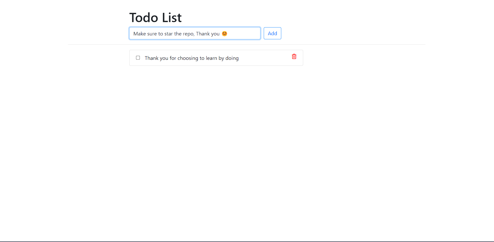

## Introduction

Django is a versatile web framework that simplifies web application development. You can learn more about Django in the official [documentation](https://docs.djangoproject.com/en/4.2/).

## About Our Application

Our app is a basic to-do app built with Django, which stores tasks in a PostgreSQL database.

## User Interface



## Getting Started

To use our Django app, ensure you have Docker installed. You can confirm this by running:

```sh
docker version
```

If Docker is installed, run the following command:

```sh
docker run -dp 8000:8000 dipanshu13/django-todo:v1
```

Now, you can access the application at `http://localhost:8000`.

[Previous](./README.md) | [Next](../01.%20Docker/README.md)