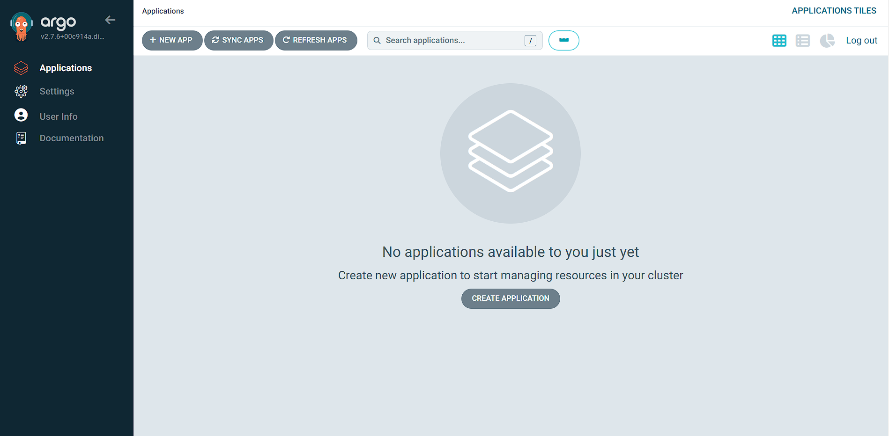
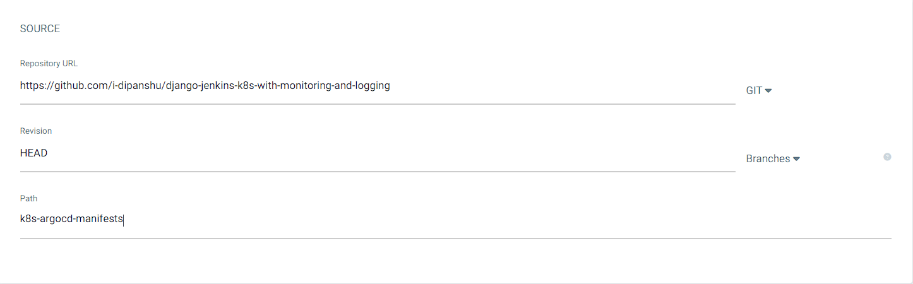
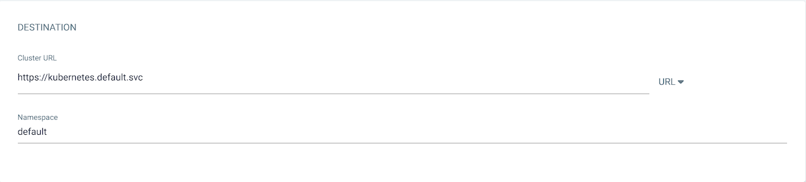
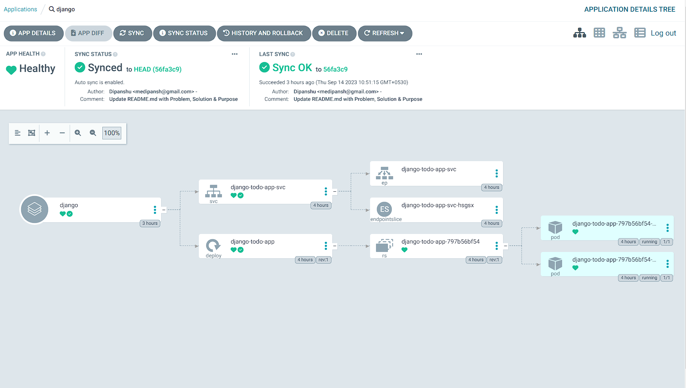
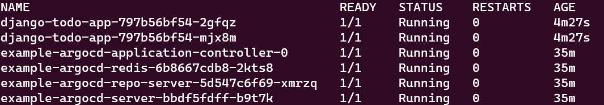

# Deploying Your Django Application with ArgoCD UI

**Before you proceed,** make sure you have configured the ArgoCD UI and have access to it.



## Creating a Deployment in Your Kubernetes Cluster Using ArgoCD

Follow these steps to create your deployment:

### General Settings
1. **Application Name:** Set this to `django-todo`.
2. **Project Name:** Choose `default`.
3. **Sync Policy:** Select `Automatic`.

### Source Configuration


Update the URL of the repository with your repository's URL and specify the path where the manifests are located.

### Destination Configuration


## Successful Deployment


To confirm that your deployment is successful, run the following command:

```shell
kubectl get pods
```



To access your application in a web browser, use the following command:

```shell
minikube service django-todo-app-svc
```

Now you should have successfully deployed your Django application using the ArgoCD UI.

[Previous](./02.%20Configure-argocd.md) | [Next](../03.%20Jenkins/README.md)